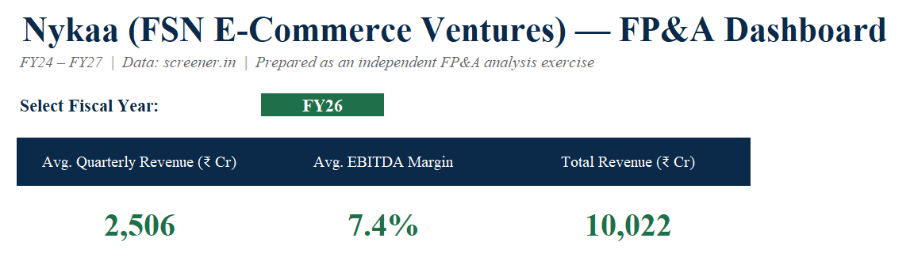
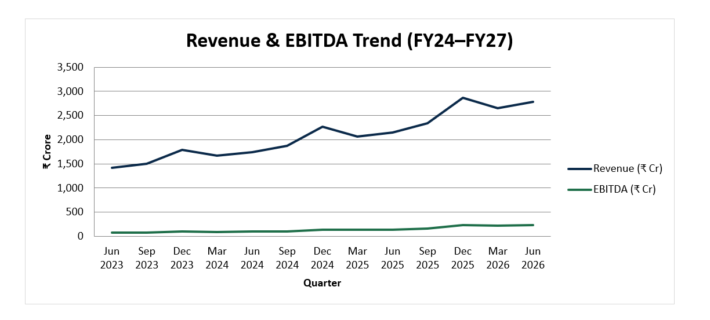
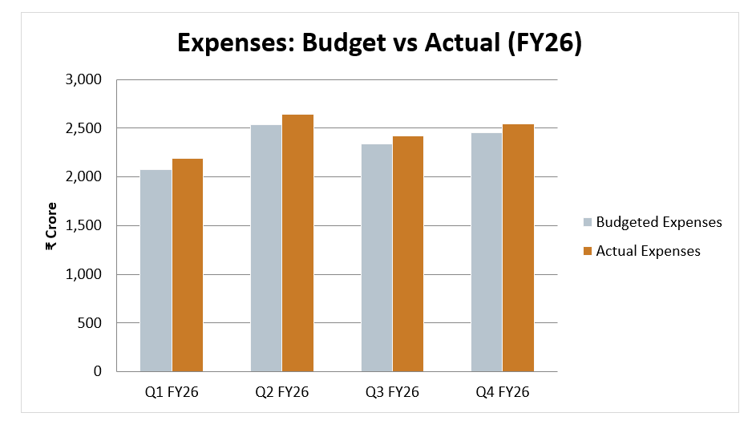

# Nykaa-FPA-Dashboard
# Nykaa FP&A Dashboard & Budget vs Actual Analysis

An FP&A-style financial planning and analysis project on Nykaa (FSN E-Commerce Ventures Ltd.), covering 3 years of quarterly performance, a budget vs actual variance analysis, and an interactive dashboard.

## What this project includes

1. **Interactive Excel Dashboard** (`Nykaa_FPA_Dashboard.xlsx`)
   - 13 quarters of revenue, expenses, and EBITDA (FY24–FY27)
   - A dropdown filter to view KPIs by fiscal year
   - Revenue & EBITDA trend chart
   - Budget vs Actual expense variance chart
   - Revenue mix by segment (Beauty vs Fashion)

2. **Written Analysis Report** (`Nykaa_Budget_vs_Actual_Report.docx`)
   - Executive summary of FY26 performance
   - Revenue and expense variance analysis with root-cause discussion
   - Actionable recommendations for improving forecasting and cost control

## Key finding

Nykaa's actual revenue beat budget by ~5% every quarter in FY26, while expense overruns shrank steadily from 5.8% to 3.6% over the year — showing improving cost discipline even through the high-spend festive quarter.

## Tools used
Excel (formulas, charts, data validation), Microsoft Word

## Data source
Nykaa (FSN E-Commerce Ventures Ltd.) quarterly results via [screener.in](https://www.screener.in). Budget figures are planning assumptions constructed for this exercise (methodology explained in the report), since internal budgets aren't publicly disclosed.

## Screenshots

